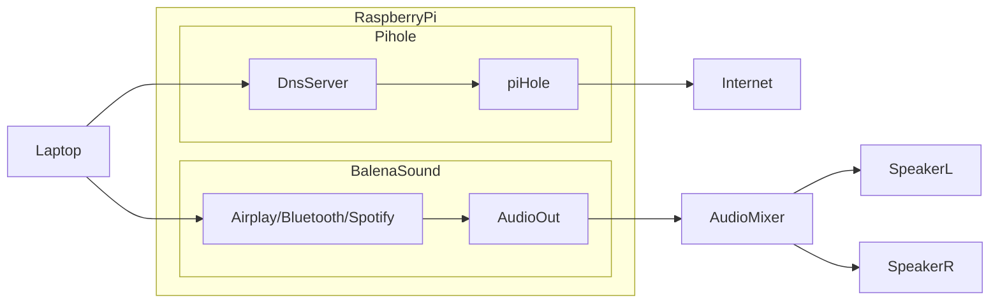

# Balena Sound Hole

A combination of Belana Sound & PiHole on a single Raspberry Pi.

Initially based on this article which showed how to configure multiple services to run on the same device:

https://blog.balena.io/two-projects-one-device-turn-your-raspberry-pi-into-a-multitool/

However the guide was incorrect so this repo is my working configuration.

## Balena Sound

Starter project enabling you to add multi-room audio streaming via Bluetooth, Airplay2, Spotify Connect and others to any old speakers or Hi-Fi using just a Raspberry Pi.

## Balena Pi Hole

This project is a [balenaCloud](https://www.balena.io/cloud) stack with the following services:

- [Pi-hole](https://pi-hole.net/)
- [PADD](https://github.com/pi-hole/PADD)
- [Unbound](https://unbound.net)
