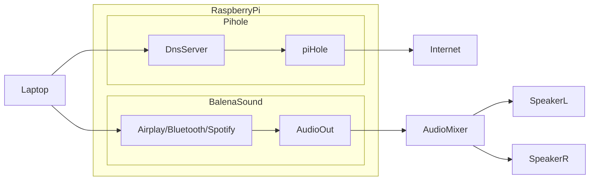
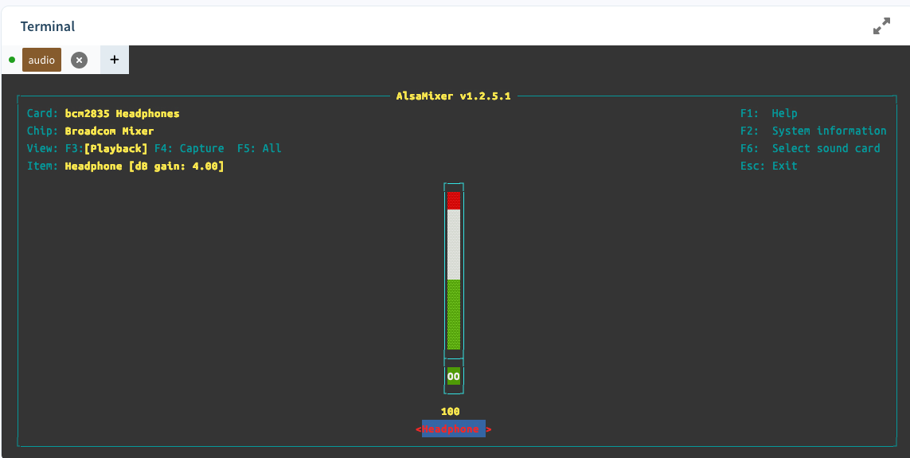

# Balena Sound Hole

A combination of Belana Sound & PiHole on a single Raspberry Pi.

Initially based on this article which showed how to configure multiple services to run on the same device:

https://blog.balena.io/two-projects-one-device-turn-your-raspberry-pi-into-a-multitool/

However the guide was incorrect so this repo is my working configuration.



## Balena Sound

[](https://github.com/balena-labs-projects/balena-sound)

Starter project enabling you to add multi-room audio streaming via Bluetooth, Airplay2, Spotify Connect and others to any old speakers or Hi-Fi using just a Raspberry Pi.

## Balena Pi Hole

<a href="https://github.com/klutchell/balena-pihole"></a>

<!-- [](https://github.com/klutchell/balena-pihole) -->

This project is a [balenaCloud](https://www.balena.io/cloud) stack with the following services:

- [Pi-hole](https://pi-hole.net/)
- [PADD](https://github.com/pi-hole/PADD)
- [Unbound](https://unbound.net)

## Configuration Changes

### Static IP Addres

Set a static IP Address in case the device reboots.

> You have to be in `/mnt/boot/system-connections` to make persistent changes.

```toml
[ipv4]
address1=192.168.1.111/24,192.168.1.1
dns=8.8.8.8;8.8.4.4;
dns-search=
method=manual
```

### Audio Output
The initial output from the 3.5mm hack was very low, even with my audio mixer turned up.

Open the terminal to the audio service and type `alsamixer`, use the up arrow to increase the volume to `100`


https://forums.raspberrypi.com/viewtopic.php?f=63&t=298119&start=25#p1799483